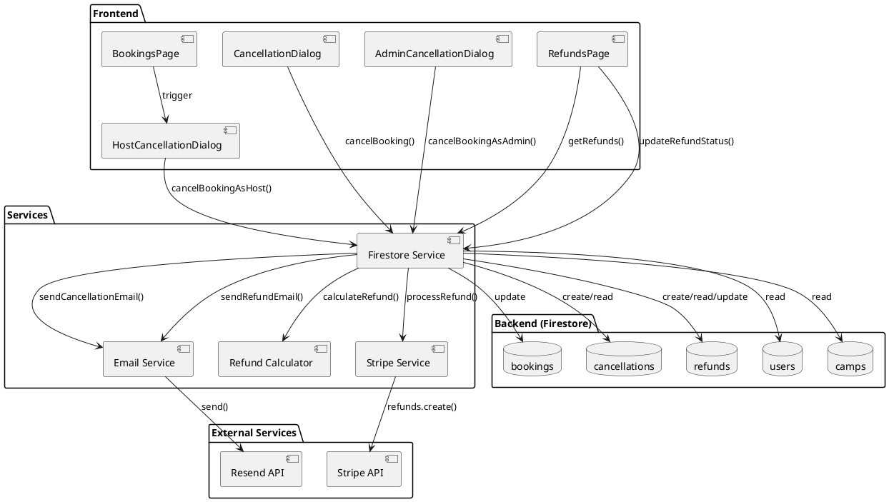
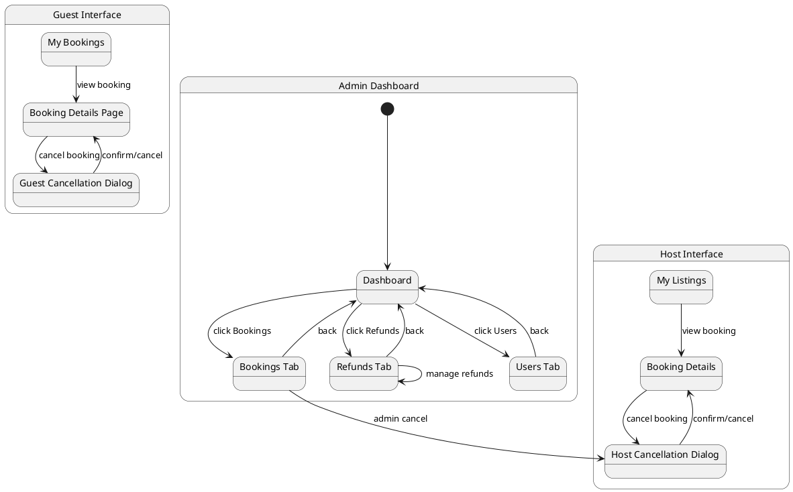
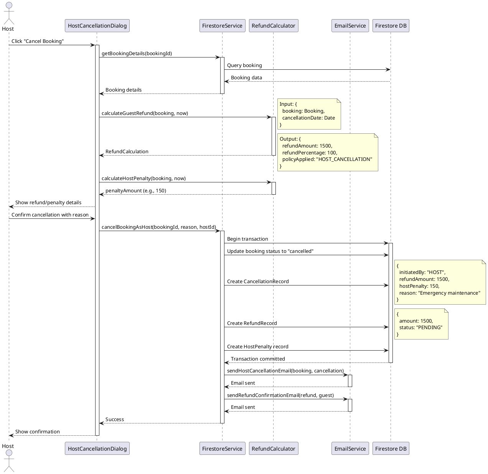
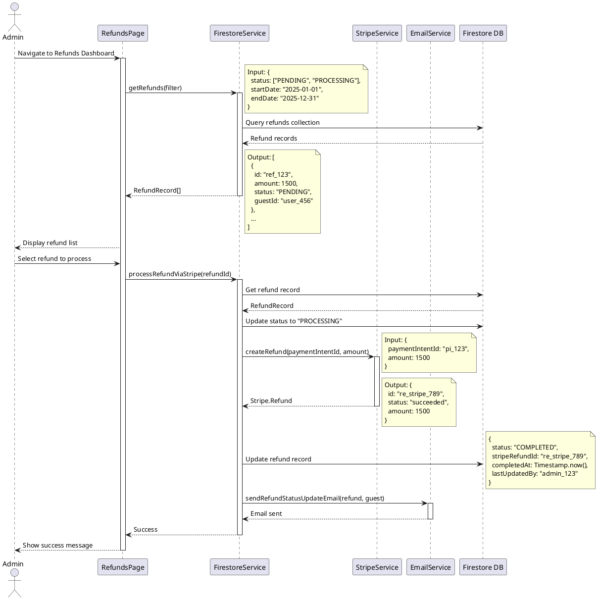
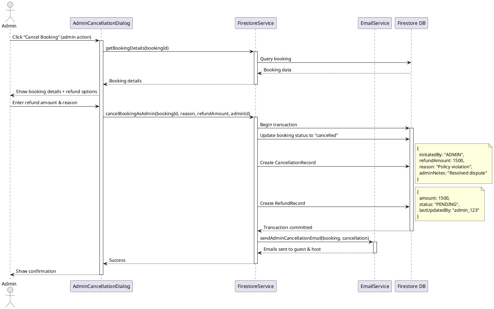

# Admin Cancellation & Refund Management System Design

## Document Information
- **Version**: 1.0
- **Date**: 2025-11-15
- **Status**: Design Phase
- **Related Systems**: Guest Cancellation System (Task 24 - Completed)

## 1. Overview

This document outlines the design for an Admin Cancellation & Refund Management system that extends the existing guest-initiated cancellation functionality. The system enables hosts to cancel bookings, provides centralized refund management for admins, and ensures comprehensive tracking of all cancellation and refund operations.

### 1.1 Existing System Foundation

The current system (Task 24) includes:
- Guest-initiated cancellation via `CancellationDialog.tsx`
- Automatic refund calculation based on cancellation policies (Flexible/Moderate/Strict)
- Firestore collections: `cancellations` and `refunds`
- Email notifications for guests and hosts
- Refund calculator utility (`refundCalculator.ts`)

### 1.2 New Requirements

1. **Host-Side Cancellations**: Hosts need ability to cancel bookings with appropriate penalties
2. **Refund Status Tracking**: Track refund lifecycle (pending → processing → completed/failed)
3. **Admin Dashboard**: Centralized interface for managing all cancellations and refunds
4. **Enhanced Notifications**: Email notifications for admin-initiated actions
5. **Audit Trail**: Complete history of all cancellation and refund operations

## 2. Implementation Approach

### 2.1 Core Components

1. **Host Cancellation Interface**
   - Reuse and extend existing `CancellationDialog.tsx`
   - Add host-specific cancellation reasons and penalties
   - Implement host cancellation policy (penalties for late cancellations)

2. **Admin Refund Dashboard**
   - New page: `src/pages/admin/Refunds.tsx`
   - Display all refunds with filtering and search
   - Manual refund status updates
   - Bulk operations support

3. **Refund Processing System**
   - Enhanced `refunds` collection with status tracking
   - Integration with payment gateway (Stripe) for actual refund processing
   - Automated status updates and notifications

4. **Enhanced Email System**
   - Admin notification templates
   - Host cancellation notification templates
   - Refund status update notifications

### 2.2 Technology Stack

- **Frontend**: React + TypeScript + Shadcn-ui
- **Backend**: Firebase Firestore
- **Email**: Resend API
- **Payment**: Stripe API (for refund processing)
- **State Management**: React hooks + Context API

## 3. User & UI Interaction Patterns

### 3.1 Host Cancellation Flow

```
1. Host navigates to "My Listings" or "Bookings" page
2. Host clicks "Cancel Booking" button on active booking
3. System displays HostCancellationDialog with:
   - Booking details
   - Cancellation policy warning
   - Host penalty calculation (if applicable)
   - Guest refund amount
   - Required cancellation reason
4. Host confirms cancellation
5. System processes:
   - Creates cancellation record (initiatedBy: 'host')
   - Calculates guest refund (100% for host cancellations)
   - Applies host penalty (if within penalty period)
   - Creates refund record
   - Sends notifications to guest and admin
6. Host sees confirmation with penalty details
```

### 3.2 Admin Refund Management Flow

```
1. Admin navigates to Admin Dashboard → Refunds tab
2. System displays refund list with filters:
   - Status: All/Pending/Processing/Completed/Failed
   - Date range
   - Amount range
   - Search by booking ID or user email
3. Admin selects refund to manage
4. Admin can:
   - View full refund details
   - Update refund status manually
   - Process refund via Stripe
   - Add admin notes
   - Resend refund confirmation email
5. System updates refund record and sends notifications
```

### 3.3 Admin Cancellation Flow

```
1. Admin navigates to Admin Dashboard → Bookings tab
2. Admin finds booking requiring cancellation
3. Admin clicks "Cancel Booking" button
4. System displays AdminCancellationDialog with:
   - Full booking details
   - Refund calculation options (full/partial/none)
   - Admin reason field (required)
   - Email notification preview
5. Admin confirms cancellation
6. System processes:
   - Creates cancellation record (initiatedBy: 'admin')
   - Creates refund record with admin-specified amount
   - Sends notifications to guest and host
   - Logs admin action
7. Admin sees confirmation
```

## 4. Architecture



## 5. UI Navigation Flow



## 6. Data Structures & Interfaces

```plantuml
@startuml

enum CancellationPolicy {
  FLEXIBLE
  MODERATE
  STRICT
}

enum RefundStatus {
  PENDING
  PROCESSING
  COMPLETED
  FAILED
  CANCELLED
}

enum CancellationInitiator {
  GUEST
  HOST
  ADMIN
}

interface CancellationRecord {
  +id: string
  +bookingId: string
  +campId: string
  +guestId: string
  +hostId: string
  +initiatedBy: CancellationInitiator
  +reason: string
  +cancellationPolicy: CancellationPolicy
  +refundAmount: number
  +refundPercentage: number
  +hostPenalty?: number
  +cancelledAt: Timestamp
  +checkInDate: Timestamp
  +checkOutDate: Timestamp
  +totalAmount: number
  +adminNotes?: string
}

interface RefundRecord {
  +id: string
  +bookingId: string
  +cancellationId: string
  +guestId: string
  +amount: number
  +status: RefundStatus
  +paymentIntentId?: string
  +stripeRefundId?: string
  +initiatedAt: Timestamp
  +processedAt?: Timestamp
  +completedAt?: Timestamp
  +failureReason?: string
  +adminNotes?: string
  +lastUpdatedBy?: string
}

interface HostPenalty {
  +bookingId: string
  +hostId: string
  +penaltyAmount: number
  +penaltyPercentage: number
  +reason: string
  +appliedAt: Timestamp
}

interface RefundFilter {
  +status?: RefundStatus[]
  +startDate?: Date
  +endDate?: Date
  +minAmount?: number
  +maxAmount?: number
  +searchQuery?: string
}

class FirestoreService {
  +cancelBooking(bookingId, reason, userId): Promise<void>
  +cancelBookingAsHost(bookingId, reason, hostId): Promise<void>
  +cancelBookingAsAdmin(bookingId, reason, refundAmount, adminId): Promise<void>
  +getRefunds(filter?: RefundFilter): Promise<RefundRecord[]>
  +updateRefundStatus(refundId, status, notes?): Promise<void>
  +processRefundViaStripe(refundId): Promise<void>
  +getCancellationsByBooking(bookingId): Promise<CancellationRecord[]>
  +getHostPenalties(hostId): Promise<HostPenalty[]>
}

class EmailService {
  +sendHostCancellationEmail(booking, cancellation): Promise<void>
  +sendAdminCancellationEmail(booking, cancellation): Promise<void>
  +sendRefundStatusUpdateEmail(refund, user): Promise<void>
  +sendHostPenaltyEmail(penalty, host): Promise<void>
}

class RefundCalculator {
  +calculateGuestRefund(booking, cancellationDate): RefundCalculation
  +calculateHostPenalty(booking, cancellationDate): number
  +isWithinHostPenaltyPeriod(checkInDate, cancellationDate): boolean
}

class StripeService {
  +createRefund(paymentIntentId, amount): Promise<Stripe.Refund>
  +getRefundStatus(refundId): Promise<RefundStatus>
}

FirestoreService --> CancellationRecord : creates
FirestoreService --> RefundRecord : creates/updates
FirestoreService --> EmailService : uses
FirestoreService --> RefundCalculator : uses
FirestoreService --> StripeService : uses

@enduml
```



## 7. Program Call Flow

### 7.1 Host-Initiated Cancellation



### 7.2 Admin Refund Management



### 7.3 Admin-Initiated Cancellation



## 8. Database Schema

### 8.1 Enhanced Cancellations Collection

```
cancellations/
  {cancellationId}/
    id: string
    bookingId: string
    campId: string
    guestId: string
    hostId: string
    initiatedBy: "guest" | "host" | "admin"
    reason: string
    cancellationPolicy: "flexible" | "moderate" | "strict"
    refundAmount: number
    refundPercentage: number
    hostPenalty?: number (NEW - only for host cancellations)
    cancelledAt: Timestamp
    checkInDate: Timestamp
    checkOutDate: Timestamp
    totalAmount: number
    adminNotes?: string (NEW - for admin cancellations)
    createdAt: Timestamp
    updatedAt: Timestamp
```

### 8.2 Enhanced Refunds Collection

```
refunds/
  {refundId}/
    id: string
    bookingId: string
    cancellationId: string
    guestId: string
    amount: number
    status: "pending" | "processing" | "completed" | "failed" | "cancelled" (ENHANCED)
    paymentIntentId?: string
    stripeRefundId?: string (NEW - Stripe refund ID)
    initiatedAt: Timestamp
    processedAt?: Timestamp (NEW - when refund processing started)
    completedAt?: Timestamp (NEW - when refund completed)
    failureReason?: string (NEW - if refund failed)
    adminNotes?: string (NEW - admin comments)
    lastUpdatedBy?: string (NEW - user/admin ID who last updated)
    createdAt: Timestamp
    updatedAt: Timestamp
```

### 8.3 New Host Penalties Collection

```
hostPenalties/
  {penaltyId}/
    id: string
    bookingId: string
    hostId: string
    penaltyAmount: number
    penaltyPercentage: number
    reason: string
    appliedAt: Timestamp
    cancellationId: string
    createdAt: Timestamp
```

### 8.4 Firestore Indexes

```javascript
// Required composite indexes
cancellations:
  - initiatedBy (ASC) + cancelledAt (DESC)
  - guestId (ASC) + cancelledAt (DESC)
  - hostId (ASC) + cancelledAt (DESC)

refunds:
  - status (ASC) + initiatedAt (DESC)
  - guestId (ASC) + status (ASC) + initiatedAt (DESC)
  - status (ASC) + amount (DESC)

hostPenalties:
  - hostId (ASC) + appliedAt (DESC)
```

## 9. Email Notification Templates

### 9.1 Host Cancellation Email (to Guest)

```
Subject: Your Booking Has Been Cancelled by the Host

Dear [Guest Name],

We regret to inform you that your booking at [Camp Name] has been cancelled by the host.

Booking Details:
- Booking ID: [Booking ID]
- Check-in: [Check-in Date]
- Check-out: [Check-out Date]
- Original Amount: $[Total Amount]

Refund Information:
- Refund Amount: $[Refund Amount] (100% refund)
- Status: Pending
- Expected Processing Time: 5-10 business days

Cancellation Reason:
[Host Reason]

We apologize for any inconvenience. You can browse alternative camps on our platform.

Best regards,
Sahra Team
```

### 9.2 Host Penalty Email (to Host)

```
Subject: Cancellation Penalty Applied

Dear [Host Name],

You have cancelled a booking for [Camp Name]. As per our cancellation policy, a penalty has been applied.

Booking Details:
- Booking ID: [Booking ID]
- Guest: [Guest Name]
- Check-in: [Check-in Date]
- Original Amount: $[Total Amount]

Penalty Information:
- Penalty Amount: $[Penalty Amount]
- Penalty Rate: [Penalty Percentage]%
- Guest Refund: $[Refund Amount] (100%)

This penalty will be deducted from your next payout.

Best regards,
Sahra Team
```

### 9.3 Admin Cancellation Email (to Guest & Host)

```
Subject: Booking Cancelled by Sahra Administration

Dear [User Name],

Your booking has been cancelled by Sahra administration.

Booking Details:
- Booking ID: [Booking ID]
- Camp: [Camp Name]
- Check-in: [Check-in Date]
- Check-out: [Check-out Date]

Refund Information:
- Refund Amount: $[Refund Amount]
- Status: Pending

Reason:
[Admin Reason]

If you have questions, please contact our support team.

Best regards,
Sahra Team
```

### 9.4 Refund Status Update Email

```
Subject: Refund Status Update - [Status]

Dear [Guest Name],

Your refund status has been updated.

Refund Details:
- Refund ID: [Refund ID]
- Booking ID: [Booking ID]
- Amount: $[Refund Amount]
- Status: [Status]
- [If completed] Processed on: [Date]
- [If failed] Failure Reason: [Reason]

[If completed]
The refund has been processed and should appear in your account within 5-10 business days.

[If failed]
We encountered an issue processing your refund. Our team is working to resolve this. You will receive another update soon.

Best regards,
Sahra Team
```

## 10. Host Cancellation Policy

### 10.1 Host Penalty Rules

```typescript
// Host cancellation penalties based on timing
const HOST_PENALTY_RULES = {
  // More than 30 days before check-in: No penalty
  NO_PENALTY_DAYS: 30,
  
  // 15-30 days before check-in: 10% penalty
  MODERATE_PENALTY: {
    days: 15,
    percentage: 10
  },
  
  // 7-14 days before check-in: 25% penalty
  HIGH_PENALTY: {
    days: 7,
    percentage: 25
  },
  
  // Less than 7 days before check-in: 50% penalty
  SEVERE_PENALTY: {
    percentage: 50
  }
};

// Guest always receives 100% refund for host cancellations
const GUEST_REFUND_PERCENTAGE = 100;
```

### 10.2 Penalty Calculation Logic

```typescript
function calculateHostPenalty(
  checkInDate: Date,
  cancellationDate: Date,
  totalAmount: number
): number {
  const daysUntilCheckIn = Math.ceil(
    (checkInDate.getTime() - cancellationDate.getTime()) / (1000 * 60 * 60 * 24)
  );
  
  if (daysUntilCheckIn > HOST_PENALTY_RULES.NO_PENALTY_DAYS) {
    return 0;
  } else if (daysUntilCheckIn >= HOST_PENALTY_RULES.MODERATE_PENALTY.days) {
    return totalAmount * (HOST_PENALTY_RULES.MODERATE_PENALTY.percentage / 100);
  } else if (daysUntilCheckIn >= HOST_PENALTY_RULES.HIGH_PENALTY.days) {
    return totalAmount * (HOST_PENALTY_RULES.HIGH_PENALTY.percentage / 100);
  } else {
    return totalAmount * (HOST_PENALTY_RULES.SEVERE_PENALTY.percentage / 100);
  }
}
```

## 11. Admin Dashboard Features

### 11.1 Refunds Page Components

1. **Refund List Table**
   - Columns: Refund ID, Booking ID, Guest, Amount, Status, Date, Actions
   - Sortable by date, amount, status
   - Pagination (20 per page)

2. **Filter Panel**
   - Status filter (multi-select)
   - Date range picker
   - Amount range slider
   - Search by booking ID or guest email

3. **Refund Detail Modal**
   - Full refund information
   - Related booking details
   - Cancellation reason
   - Status history timeline
   - Admin notes field
   - Action buttons: Process, Update Status, Resend Email

4. **Bulk Actions**
   - Select multiple refunds
   - Bulk status update
   - Bulk export to CSV

### 11.2 Enhanced Bookings Page

Add "Cancel Booking" button for admins with:
- Custom refund amount input
- Admin reason field (required)
- Email preview before sending
- Confirmation dialog

### 11.3 Statistics Dashboard

Add new metrics:
- Total refunds processed (this month)
- Pending refunds count
- Failed refunds requiring attention
- Host cancellation rate
- Average refund processing time

## 12. Integration Points

### 12.1 Existing System Integration

1. **CancellationDialog.tsx**
   - Extend with `initiatedBy` prop
   - Add host/admin variants
   - Reuse refund calculation logic

2. **firestore.ts**
   - Enhance `cancelBooking()` with initiator parameter
   - Add `cancelBookingAsHost()`
   - Add `cancelBookingAsAdmin()`
   - Add refund status update functions

3. **refundCalculator.ts**
   - Add `calculateHostPenalty()` function
   - Add `isWithinHostPenaltyPeriod()` helper

### 12.2 New Components Required

1. `src/components/HostCancellationDialog.tsx` - Host-specific cancellation UI
2. `src/components/AdminCancellationDialog.tsx` - Admin-specific cancellation UI
3. `src/pages/admin/Refunds.tsx` - Admin refund management dashboard
4. `src/lib/stripeService.ts` - Stripe refund processing
5. `src/components/RefundStatusBadge.tsx` - Status indicator component
6. `src/components/RefundDetailModal.tsx` - Detailed refund view

## 13. Security Considerations

### 13.1 Firestore Security Rules

```javascript
// Enhanced security rules for new collections
rules_version = '2';
service cloud.firestore {
  match /databases/{database}/documents {
    
    // Cancellations - read by involved parties, write by system
    match /cancellations/{cancellationId} {
      allow read: if request.auth != null && (
        resource.data.guestId == request.auth.uid ||
        resource.data.hostId == request.auth.uid ||
        get(/databases/$(database)/documents/users/$(request.auth.uid)).data.role == 'admin'
      );
      allow write: if false; // Only via Cloud Functions or admin SDK
    }
    
    // Refunds - read by guest and admin, write by admin only
    match /refunds/{refundId} {
      allow read: if request.auth != null && (
        resource.data.guestId == request.auth.uid ||
        get(/databases/$(database)/documents/users/$(request.auth.uid)).data.role == 'admin'
      );
      allow update: if request.auth != null &&
        get(/databases/$(database)/documents/users/$(request.auth.uid)).data.role == 'admin' &&
        request.resource.data.diff(resource.data).affectedKeys().hasOnly(['status', 'adminNotes', 'lastUpdatedBy', 'updatedAt', 'processedAt', 'completedAt', 'failureReason']);
      allow create: if false; // Only via system
    }
    
    // Host Penalties - read by host and admin only
    match /hostPenalties/{penaltyId} {
      allow read: if request.auth != null && (
        resource.data.hostId == request.auth.uid ||
        get(/databases/$(database)/documents/users/$(request.auth.uid)).data.role == 'admin'
      );
      allow write: if false; // Only via system
    }
  }
}
```

### 13.2 Authorization Checks

```typescript
// Verify user permissions before cancellation
async function canCancelBooking(
  bookingId: string,
  userId: string,
  role: 'guest' | 'host' | 'admin'
): Promise<boolean> {
  const booking = await getBooking(bookingId);
  
  switch (role) {
    case 'guest':
      return booking.guestId === userId && booking.status === 'confirmed';
    case 'host':
      return booking.hostId === userId && booking.status === 'confirmed';
    case 'admin':
      return true; // Admins can cancel any booking
    default:
      return false;
  }
}
```

## 14. Error Handling

### 14.1 Refund Processing Errors

```typescript
enum RefundErrorType {
  STRIPE_API_ERROR = 'stripe_api_error',
  INSUFFICIENT_FUNDS = 'insufficient_funds',
  PAYMENT_NOT_FOUND = 'payment_not_found',
  ALREADY_REFUNDED = 'already_refunded',
  NETWORK_ERROR = 'network_error'
}

interface RefundError {
  type: RefundErrorType;
  message: string;
  retryable: boolean;
  timestamp: Date;
}

// Retry logic for transient errors
async function processRefundWithRetry(
  refundId: string,
  maxRetries: number = 3
): Promise<void> {
  let attempt = 0;
  
  while (attempt < maxRetries) {
    try {
      await processRefund(refundId);
      return;
    } catch (error) {
      const refundError = classifyError(error);
      
      if (!refundError.retryable || attempt === maxRetries - 1) {
        await updateRefundStatus(refundId, 'failed', refundError.message);
        await notifyAdminOfFailedRefund(refundId, refundError);
        throw error;
      }
      
      attempt++;
      await delay(Math.pow(2, attempt) * 1000); // Exponential backoff
    }
  }
}
```

### 14.2 Cancellation Validation

```typescript
// Validate cancellation before processing
async function validateCancellation(
  bookingId: string,
  initiator: CancellationInitiator
): Promise<ValidationResult> {
  const booking = await getBooking(bookingId);
  
  const errors: string[] = [];
  
  // Check booking status
  if (booking.status !== 'confirmed') {
    errors.push('Only confirmed bookings can be cancelled');
  }
  
  // Check if already cancelled
  if (booking.status === 'cancelled') {
    errors.push('Booking is already cancelled');
  }
  
  // Check if check-in date has passed
  if (booking.checkInDate < new Date()) {
    errors.push('Cannot cancel bookings after check-in date');
  }
  
  // Check for existing cancellation
  const existingCancellation = await getCancellationByBooking(bookingId);
  if (existingCancellation) {
    errors.push('Cancellation already exists for this booking');
  }
  
  return {
    valid: errors.length === 0,
    errors
  };
}
```

## 15. Testing Strategy

### 15.1 Unit Tests

```typescript
// Test refund calculation
describe('RefundCalculator', () => {
  test('calculates 100% refund for host cancellations', () => {
    const result = calculateGuestRefund(booking, new Date(), 'host');
    expect(result.refundPercentage).toBe(100);
  });
  
  test('calculates host penalty correctly', () => {
    const penalty = calculateHostPenalty(checkInDate, cancellationDate, 1000);
    expect(penalty).toBe(250); // 25% penalty
  });
});

// Test Firestore operations
describe('FirestoreService', () => {
  test('creates cancellation record with correct initiator', async () => {
    await cancelBookingAsHost(bookingId, reason, hostId);
    const cancellation = await getCancellationByBooking(bookingId);
    expect(cancellation.initiatedBy).toBe('host');
  });
  
  test('updates refund status correctly', async () => {
    await updateRefundStatus(refundId, 'completed');
    const refund = await getRefund(refundId);
    expect(refund.status).toBe('completed');
    expect(refund.completedAt).toBeDefined();
  });
});
```

### 15.2 Integration Tests

```typescript
// Test end-to-end host cancellation flow
describe('Host Cancellation Flow', () => {
  test('completes full cancellation with penalty', async () => {
    const booking = await createTestBooking();
    
    await cancelBookingAsHost(booking.id, 'Emergency', host.id);
    
    const cancellation = await getCancellationByBooking(booking.id);
    expect(cancellation.initiatedBy).toBe('host');
    expect(cancellation.hostPenalty).toBeGreaterThan(0);
    
    const refund = await getRefundByCancellation(cancellation.id);
    expect(refund.amount).toBe(booking.totalAmount);
    expect(refund.status).toBe('pending');
    
    const penalty = await getHostPenalty(booking.id);
    expect(penalty.hostId).toBe(host.id);
  });
});

// Test admin refund processing
describe('Admin Refund Processing', () => {
  test('processes refund via Stripe successfully', async () => {
    const refund = await createTestRefund();
    
    await processRefundViaStripe(refund.id);
    
    const updatedRefund = await getRefund(refund.id);
    expect(updatedRefund.status).toBe('completed');
    expect(updatedRefund.stripeRefundId).toBeDefined();
  });
});
```

### 15.3 Manual Testing Checklist

- [ ] Host cancels booking > 30 days before check-in (no penalty)
- [ ] Host cancels booking 15-30 days before check-in (10% penalty)
- [ ] Host cancels booking 7-14 days before check-in (25% penalty)
- [ ] Host cancels booking < 7 days before check-in (50% penalty)
- [ ] Admin cancels booking with custom refund amount
- [ ] Admin processes pending refund via Stripe
- [ ] Admin updates refund status manually
- [ ] Email notifications sent for all cancellation types
- [ ] Refund status updates trigger email notifications
- [ ] Filter and search functionality on Refunds page
- [ ] Bulk refund operations work correctly
- [ ] Security rules prevent unauthorized access

## 16. Performance Considerations

### 16.1 Database Query Optimization

```typescript
// Use pagination for large refund lists
async function getRefundsPaginated(
  filter: RefundFilter,
  pageSize: number = 20,
  lastDoc?: DocumentSnapshot
): Promise<{ refunds: RefundRecord[], lastDoc: DocumentSnapshot }> {
  let query = db.collection('refunds')
    .orderBy('initiatedAt', 'desc')
    .limit(pageSize);
  
  if (filter.status) {
    query = query.where('status', 'in', filter.status);
  }
  
  if (lastDoc) {
    query = query.startAfter(lastDoc);
  }
  
  const snapshot = await query.get();
  
  return {
    refunds: snapshot.docs.map(doc => doc.data() as RefundRecord),
    lastDoc: snapshot.docs[snapshot.docs.length - 1]
  };
}
```

### 16.2 Caching Strategy

```typescript
// Cache refund statistics
const CACHE_TTL = 5 * 60 * 1000; // 5 minutes

let refundStatsCache: {
  data: RefundStatistics | null;
  timestamp: number;
} = { data: null, timestamp: 0 };

async function getRefundStatistics(): Promise<RefundStatistics> {
  const now = Date.now();
  
  if (refundStatsCache.data && (now - refundStatsCache.timestamp) < CACHE_TTL) {
    return refundStatsCache.data;
  }
  
  const stats = await calculateRefundStatistics();
  refundStatsCache = { data: stats, timestamp: now };
  
  return stats;
}
```

## 17. Monitoring & Analytics

### 17.1 Key Metrics to Track

1. **Cancellation Metrics**
   - Total cancellations by initiator (guest/host/admin)
   - Cancellation rate by camp
   - Average time between booking and cancellation
   - Cancellation reasons distribution

2. **Refund Metrics**
   - Total refund amount processed
   - Average refund processing time
   - Refund success/failure rate
   - Pending refunds count and age

3. **Host Penalty Metrics**
   - Total penalties applied
   - Average penalty amount
   - Hosts with multiple penalties
   - Penalty distribution by timing

### 17.2 Logging Strategy

```typescript
// Log all critical operations
async function logCancellationEvent(
  event: 'initiated' | 'completed' | 'failed',
  cancellation: CancellationRecord
): Promise<void> {
  await db.collection('auditLogs').add({
    type: 'cancellation',
    event,
    cancellationId: cancellation.id,
    bookingId: cancellation.bookingId,
    initiatedBy: cancellation.initiatedBy,
    timestamp: Timestamp.now(),
    metadata: {
      refundAmount: cancellation.refundAmount,
      hostPenalty: cancellation.hostPenalty
    }
  });
}

async function logRefundEvent(
  event: 'created' | 'processing' | 'completed' | 'failed',
  refund: RefundRecord
): Promise<void> {
  await db.collection('auditLogs').add({
    type: 'refund',
    event,
    refundId: refund.id,
    bookingId: refund.bookingId,
    status: refund.status,
    amount: refund.amount,
    timestamp: Timestamp.now(),
    lastUpdatedBy: refund.lastUpdatedBy
  });
}
```

## 18. Future Enhancements

### 18.1 Phase 2 Features

1. **Automated Refund Processing**
   - Scheduled job to process pending refunds automatically
   - Retry mechanism for failed refunds
   - Automatic status updates

2. **Dispute Resolution System**
   - Allow guests to dispute cancellations
   - Admin review and decision workflow
   - Evidence upload (messages, photos)

3. **Host Performance Tracking**
   - Cancellation rate impact on host ranking
   - Automatic warnings for frequent cancellations
   - Suspension for excessive cancellations

4. **Advanced Analytics Dashboard**
   - Cancellation trends over time
   - Predictive analytics for high-risk bookings
   - Financial impact reports

### 18.2 Phase 3 Features

1. **Partial Refunds**
   - Support for partial refunds (e.g., 75%, 25%)
   - Custom refund amount calculations
   - Split refunds (partial now, partial later)

2. **Refund to Credit**
   - Option to convert refund to platform credit
   - Bonus credit for choosing platform credit
   - Credit expiration management

3. **Automated Compensation**
   - Automatic compensation for host cancellations
   - Discount codes for next booking
   - Priority support for affected guests

## 19. UNCLEAR ASPECTS

1. **Stripe Integration Details**
   - Need Stripe API credentials and account setup
   - Clarify refund processing fees (who pays?)
   - Confirm payment intent ID storage in bookings

2. **Host Penalty Collection**
   - How are host penalties actually collected?
   - Deduct from next payout or charge immediately?
   - What if host has no upcoming payouts?

3. **Admin Permissions**
   - Should there be different admin roles (super admin, support admin)?
   - What are the limits on admin refund amount overrides?
   - Should admin actions require approval from another admin?

4. **Refund Processing Timeline**
   - What is the expected SLA for refund processing?
   - Should there be automatic escalation for delayed refunds?
   - How to handle refunds that take longer than expected?

5. **Email Delivery Failures**
   - What happens if email notifications fail?
   - Should there be a retry mechanism?
   - Alternative notification methods (SMS, in-app)?

6. **Multi-Currency Support**
   - Are all transactions in USD or multiple currencies?
   - How to handle currency conversion for refunds?
   - Exchange rate considerations?

7. **Tax Implications**
   - How are taxes handled in refunds?
   - Should tax amount be refunded separately?
   - Need tax calculation logic for partial refunds?

---

## Document Change Log

| Version | Date | Author | Changes |
|---------|------|--------|---------|
| 1.0 | 2025-11-15 | Bob (Architect) | Initial design document |
