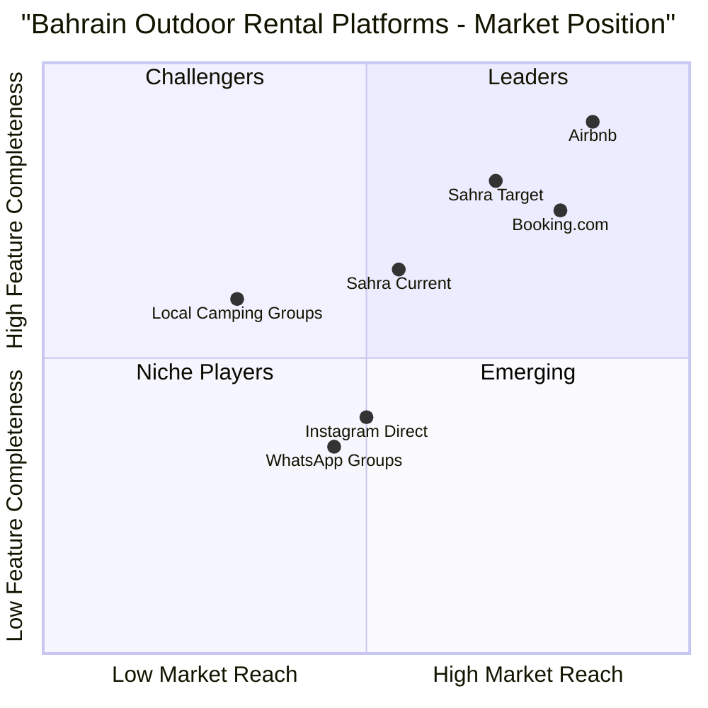

# Product Requirements Document: Kashta Listing Type Feature

## Document Information
- **Project**: Sahra Platform
- **Feature**: Kashta (كشتة) Listing Type Addition
- **Version**: 1.0
- **Date**: December 7, 2025
- **Author**: Emma (Product Manager)
- **Language**: English
- **Programming Language**: TypeScript, React, Tailwind CSS, Shadcn-ui
- **Backend Service**: Firebase (Firestore)

---

## 1. Executive Summary

### 1.1 Background
Sahra is a camping rental platform serving Bahrain's موسم البر (camping season) in Sakhir. Currently, the platform only supports traditional desert camps (مخيمات). However, there's a growing market for beachfront Kashta (كشتة) rentals - small seaside sitting areas that people rent for gatherings.

### 1.2 Objective
Expand the Sahra platform to support two distinct listing types: **Camps** and **Kashta**, enabling hosts to list both types and guests to search, filter, and book either option based on their preferences.

### 1.3 Success Metrics
- 30% of new listings are Kashta within first 3 months
- 25% increase in total bookings
- 90% user satisfaction with type selection feature
- Zero confusion between listing types in user feedback

---

## 2. Product Goals

### 2.1 Primary Goals
1. Enable hosts to create and manage Kashta listings with appropriate attributes
2. Allow guests to easily distinguish and search between Camps and Kashta
3. Maintain platform consistency while accommodating type-specific features
4. Provide seamless bilingual experience (English/Arabic)

### 2.2 User Stories

#### As a Kashta Host:
- I want to create a Kashta listing so that I can rent my beachfront sitting area
- I want to specify beach-specific amenities (shade, seating capacity, BBQ area) so guests know what to expect
- I want to set pricing appropriate for smaller beachfront spaces
- I want to manage my Kashta bookings separately from camp bookings

#### As a Camp Host:
- I want my existing camp listings to remain unchanged
- I want to optionally add Kashta listings to my portfolio
- I want to manage both listing types from the same dashboard

#### As a Guest:
- I want to choose between Camps and Kashta on the home page so I can find the right experience
- I want to filter search results by listing type
- I want to see type-specific amenities and features
- I want to understand the difference between Camps and Kashta before booking

#### As an Admin:
- I want to view analytics for both listing types separately
- I want to moderate both Camps and Kashta listings
- I want to manage pricing and policies per listing type

---

## 3. Competitive Analysis

### 3.1 Existing Solutions

| Platform | Listing Types | Strengths | Weaknesses | Market Position |
|----------|---------------|-----------|------------|-----------------|
| **Airbnb** | Multiple (apartments, houses, unique stays) | Robust filtering, clear categorization | Not localized for Bahrain camping culture | Global leader (0.85, 0.90) |
| **Booking.com** | Hotels, apartments, vacation homes | Extensive inventory, trusted brand | No camping/kashta focus | Established player (0.80, 0.75) |
| **Local Camping Groups** | Camps only | Local knowledge, community trust | No kashta support, manual booking | Niche player (0.30, 0.60) |
| **Instagram Direct** | Both camps & kashta | Visual appeal, direct communication | No booking system, unreliable | Informal market (0.50, 0.40) |
| **WhatsApp Groups** | Both types | Easy communication | No search/filter, payment issues | Informal market (0.45, 0.35) |
| **Sahra (Current)** | Camps only | Localized, bilingual, modern UI | Missing kashta market segment | Growing platform (0.55, 0.65) |
| **Sahra (Target)** | Camps + Kashta | Complete market coverage, type-specific features | New feature needs validation | Target position (0.70, 0.80) |

### 3.2 Competitive Quadrant Chart



### 3.3 Key Insights
- **Gap in Market**: No platform currently serves both camps and kashta with proper categorization
- **Opportunity**: Capture the beachfront kashta market (estimated 40% of outdoor rental demand)
- **Differentiation**: Type-specific amenities and search filters tailored to Bahrain culture
- **Competitive Advantage**: First-mover advantage in dual-type outdoor rental platform for Bahrain

---

## 4. Requirements Analysis

### 4.1 Functional Requirements

#### FR1: Listing Type Selection (P0 - Must Have)
- **Description**: Users must be able to select listing type (Camp or Kashta) when creating a listing
- **Acceptance Criteria**:
  - Radio button or toggle for type selection on create listing page
  - Type selection is mandatory before proceeding
  - Type is immutable after listing creation (requires admin to change)
  - Clear visual distinction between types throughout the platform

#### FR2: Type-Specific Attributes (P0 - Must Have)
- **Description**: Each listing type has unique attributes and amenities
- **Acceptance Criteria**:
  - **Camp Attributes**:
    - Location: Desert/Sakhir area
    - Capacity: 10-50+ guests
    - Amenities: Tents, electricity, bathrooms, parking, majlis, fire pit
    - Features: Number of tents, tent sizes, bathroom count
  - **Kashta Attributes**:
    - Location: Beachfront/coastal area
    - Capacity: 5-15 guests
    - Amenities: Shade structure, seating area, BBQ area, water access, parking
    - Features: Seating capacity, shade type, beach access type

#### FR3: Home Page Type Selector (P0 - Must Have)
- **Description**: Users can choose their preferred listing type from the home page
- **Acceptance Criteria**:
  - Prominent type selector (tabs or cards) above search bar
  - Default shows both types
  - Selection persists during session
  - Visual indicators show active selection
  - Bilingual labels (Camp/مخيم, Kashta/كشتة)

#### FR4: Search and Filter by Type (P0 - Must Have)
- **Description**: Users can filter search results by listing type
- **Acceptance Criteria**:
  - Type filter in search sidebar
  - Multi-select support (show both, camps only, kashta only)
  - Filter persists across page navigation
  - Results count updates based on type filter
  - Clear filter indication in UI

#### FR5: Type-Specific Listing Cards (P1 - Should Have)
- **Description**: Listing cards display type-specific information
- **Acceptance Criteria**:
  - Type badge on listing card (Camp/Kashta)
  - Type-specific icons (tent for camp, beach umbrella for kashta)
  - Display relevant amenities based on type
  - Color coding or visual distinction

#### FR6: Booking Flow for Both Types (P0 - Must Have)
- **Description**: Booking process accommodates both listing types
- **Acceptance Criteria**:
  - Same booking flow works for both types
  - Confirmation shows listing type
  - Type-specific booking details displayed
  - Email confirmations mention listing type

#### FR7: Host Dashboard Type Management (P1 - Should Have)
- **Description**: Hosts can manage both listing types from dashboard
- **Acceptance Criteria**:
  - Filter listings by type in host dashboard
  - Type indicator on each listing card
  - Separate analytics per type
  - Ability to create both types

#### FR8: Admin Type Management (P1 - Should Have)
- **Description**: Admins can manage and moderate both listing types
- **Acceptance Criteria**:
  - Filter admin listings view by type
  - Type-specific analytics dashboard
  - Ability to change listing type (with validation)
  - Bulk operations support type filtering

### 4.2 Non-Functional Requirements

#### NFR1: Performance (P0 - Must Have)
- Type filtering should not increase page load time by more than 100ms
- Search results should render within 500ms regardless of type filter
- Database queries optimized with proper indexing on listingType field

#### NFR2: Scalability (P1 - Should Have)
- System should support adding additional listing types in future (e.g., RV spots, glamping)
- Type-specific logic should be modular and extensible
- Database schema should accommodate new types without migration

#### NFR3: Usability (P0 - Must Have)
- Type selection should be intuitive for first-time users
- No more than 2 clicks to switch between types
- Clear visual feedback for type selection
- Bilingual support for all type-related UI elements

#### NFR4: Reliability (P0 - Must Have)
- Type field must be validated on both frontend and backend
- Existing camp listings must be automatically migrated to "camp" type
- No data loss during type implementation
- Rollback plan in case of issues

---

## 5. Technical Specifications

### 5.1 Database Schema Changes

#### 5.1.1 Firestore Collections Update

**Collection: `camps` (to be renamed to `listings`)**

```typescript
interface Listing {
  id: string;
  listingType: 'camp' | 'kashta'; // NEW FIELD
  title: string;
  description: string;
  location: {
    address: string;
    city: string;
    coordinates?: {
      lat: number;
      lng: number;
    };
    locationType: 'desert' | 'beach' | 'other'; // NEW FIELD
  };
  pricing: {
    basePrice: number;
    currency: 'BHD';
    pricePerNight: boolean;
    pricePerGuest: boolean;
  };
  capacity: {
    maxGuests: number;
    minGuests: number;
    // Camp-specific
    numberOfTents?: number;
    tentSizes?: string[];
    numberOfBathrooms?: number;
    // Kashta-specific
    seatingCapacity?: number;
    shadeType?: 'tent' | 'umbrella' | 'pergola' | 'natural';
    beachAccessType?: 'direct' | 'nearby' | 'private';
  };
  amenities: {
    // Common amenities
    parking: boolean;
    bbqArea: boolean;
    // Camp-specific
    electricity?: boolean;
    bathrooms?: boolean;
    majlis?: boolean;
    firePit?: boolean;
    // Kashta-specific
    shadeStructure?: boolean;
    seatingArea?: boolean;
    waterAccess?: boolean;
    beachToys?: boolean;
  };
  images: string[];
  hostId: string;
  status: 'active' | 'inactive' | 'pending';
  cancellationPolicy: 'flexible' | 'moderate' | 'strict';
  createdAt: Timestamp;
  updatedAt: Timestamp;
}
```

#### 5.1.2 Migration Strategy

```typescript
// Migration script to add listingType to existing listings
async function migrateExistingListings() {
  const listingsRef = collection(db, 'camps');
  const snapshot = await getDocs(listingsRef);
  
  const batch = writeBatch(db);
  snapshot.docs.forEach(doc => {
    batch.update(doc.ref, {
      listingType: 'camp', // Default all existing to 'camp'
      'location.locationType': 'desert',
      updatedAt: serverTimestamp()
    });
  });
  
  await batch.commit();
}
```

#### 5.1.3 Firestore Indexes

```
// Required composite indexes
Collection: listings
- listingType (Ascending) + status (Ascending) + createdAt (Descending)
- listingType (Ascending) + location.city (Ascending) + pricing.basePrice (Ascending)
- hostId (Ascending) + listingType (Ascending) + status (Ascending)
```

### 5.2 Frontend Components

#### 5.2.1 New Components

**1. TypeSelector Component**
```typescript
// src/components/TypeSelector.tsx
interface TypeSelectorProps {
  selectedType: 'all' | 'camp' | 'kashta';
  onTypeChange: (type: 'all' | 'camp' | 'kashta') => void;
  variant?: 'tabs' | 'cards';
}
```

**2. ListingTypeCard Component**
```typescript
// src/components/ListingTypeCard.tsx
interface ListingTypeCardProps {
  type: 'camp' | 'kashta';
  title: string;
  description: string;
  icon: ReactNode;
  isSelected: boolean;
  onClick: () => void;
}
```

**3. TypeSpecificAmenities Component**
```typescript
// src/components/TypeSpecificAmenities.tsx
interface TypeSpecificAmenitiesProps {
  listingType: 'camp' | 'kashta';
  amenities: Listing['amenities'];
  capacity: Listing['capacity'];
}
```

#### 5.2.2 Modified Components

**1. Index.tsx (Home Page)**
- Add TypeSelector above search bar
- Update search logic to filter by type
- Add type to URL params for deep linking

**2. CreateListing.tsx**
- Add type selection as first step
- Conditionally render type-specific fields
- Update form validation based on type
- Update amenities list based on type

**3. EditListing.tsx**
- Display current type (read-only)
- Show type-specific fields only
- Validate type-specific required fields

**4. CampDetails.tsx (rename to ListingDetails.tsx)**
- Display type badge
- Show type-specific amenities
- Render type-specific capacity info

**5. Filters Component**
- Add type filter checkbox group
- Update filter state management
- Apply type filter to search query

**6. ListingCard Component**
- Add type badge
- Display type-specific icon
- Show relevant amenities based on type

### 5.3 State Management

#### 5.3.1 Context Updates

**SearchContext.tsx**
```typescript
interface SearchState {
  query: string;
  location: string;
  checkIn: Date | null;
  checkOut: Date | null;
  guests: number;
  listingType: 'all' | 'camp' | 'kashta'; // NEW
  filters: {
    priceRange: [number, number];
    amenities: string[];
    // ... existing filters
  };
}
```

**ListingContext.tsx**
```typescript
interface ListingState {
  listings: Listing[];
  filteredListings: Listing[];
  selectedType: 'all' | 'camp' | 'kashta'; // NEW
  loading: boolean;
  error: string | null;
}
```

### 5.4 API/Firebase Functions

#### 5.4.1 New Functions

```typescript
// src/lib/listings.ts

export async function getListingsByType(
  type: 'camp' | 'kashta' | 'all',
  filters?: SearchFilters
): Promise<Listing[]> {
  const listingsRef = collection(db, 'listings');
  let q = query(listingsRef, where('status', '==', 'active'));
  
  if (type !== 'all') {
    q = query(q, where('listingType', '==', type));
  }
  
  // Apply additional filters...
  
  const snapshot = await getDocs(q);
  return snapshot.docs.map(doc => ({ id: doc.id, ...doc.data() } as Listing));
}

export async function createListing(
  listingData: Omit<Listing, 'id' | 'createdAt' | 'updatedAt'>
): Promise<string> {
  // Validate type-specific required fields
  validateListingByType(listingData);
  
  const listingsRef = collection(db, 'listings');
  const docRef = await addDoc(listingsRef, {
    ...listingData,
    createdAt: serverTimestamp(),
    updatedAt: serverTimestamp()
  });
  
  return docRef.id;
}

function validateListingByType(listing: Partial<Listing>): void {
  if (listing.listingType === 'camp') {
    if (!listing.capacity?.numberOfTents) {
      throw new Error('Number of tents is required for camps');
    }
    if (!listing.amenities?.bathrooms) {
      throw new Error('Bathroom information is required for camps');
    }
  } else if (listing.listingType === 'kashta') {
    if (!listing.capacity?.seatingCapacity) {
      throw new Error('Seating capacity is required for kashta');
    }
    if (!listing.capacity?.shadeType) {
      throw new Error('Shade type is required for kashta');
    }
  }
}
```

### 5.5 Routing Updates

```typescript
// src/App.tsx - No routing changes needed
// Existing routes work for both types:
// - / (home with type selector)
// - /listing/:id (works for both types)
// - /create-listing (add type selection)
// - /edit-listing/:id (show type-specific fields)
```

---

## 6. UI/UX Design Requirements

### 6.1 Home Page Type Selector

**Design Option 1: Tab-Based Selector**
```
┌─────────────────────────────────────────┐
│  [All]  [Camps مخيمات]  [Kashta كشتة]  │
│  ────────────────────────────────────   │
│                                         │
│  🔍 Search by location...               │
│  📅 Check-in  →  📅 Check-out          │
│  👥 Guests                              │
│                                         │
│  [Search]                               │
└─────────────────────────────────────────┘
```

**Design Option 2: Card-Based Selector**
```
┌──────────────────┐  ┌──────────────────┐
│   🏕️ Camps       │  │   🏖️ Kashta      │
│   مخيمات         │  │   كشتة           │
│                  │  │                  │
│ Desert camping   │  │ Beachfront spots │
│ 10-50 guests     │  │ 5-15 guests      │
│                  │  │                  │
│ [Select]         │  │ [Select]         │
└──────────────────┘  └──────────────────┘
```

### 6.2 Listing Card Type Badge

```
┌─────────────────────────────────┐
│  [CAMP مخيم] 🏕️                │
│  ┌─────────────────────────┐   │
│  │                         │   │
│  │    Listing Image        │   │
│  │                         │   │
│  └─────────────────────────┘   │
│  Desert Oasis Camp              │
│  📍 Sakhir                      │
│  ⭐ 4.8 (24 reviews)            │
│  💰 25 BHD/night                │
│  👥 Up to 30 guests             │
│  🏕️ 5 tents                     │
└─────────────────────────────────┘
```

### 6.3 Create Listing Type Selection

```
Step 1: Choose Listing Type
┌─────────────────────────────────────────┐
│                                         │
│  What type of listing do you have?      │
│                                         │
│  ○ Camp (مخيم)                         │
│     Traditional desert camping site     │
│     • 10-50+ guests                     │
│     • Tents, electricity, facilities    │
│                                         │
│  ○ Kashta (كشتة)                       │
│     Beachfront sitting area             │
│     • 5-15 guests                       │
│     • Shade, seating, beach access      │
│                                         │
│  [Continue]                             │
└─────────────────────────────────────────┘
```

### 6.4 Type-Specific Amenities Display

**Camp Amenities:**
```
🏕️ Camp Features
├─ ✅ 5 Tents (sleeps 30)
├─ ✅ 3 Bathrooms
├─ ✅ Electricity
├─ ✅ Parking (10 cars)
├─ ✅ Majlis seating
└─ ✅ Fire pit
```

**Kashta Amenities:**
```
🏖️ Kashta Features
├─ ✅ Pergola shade
├─ ✅ Seating for 12
├─ ✅ Direct beach access
├─ ✅ BBQ area
├─ ✅ Parking (5 cars)
└─ ✅ Beach toys included
```

### 6.5 Filter Sidebar

```
┌─────────────────────┐
│ Filters             │
├─────────────────────┤
│ Listing Type        │
│ ☑ All               │
│ ☐ Camps مخيمات      │
│ ☐ Kashta كشتة       │
├─────────────────────┤
│ Price Range         │
│ [slider] 10-100 BHD │
├─────────────────────┤
│ Capacity            │
│ [slider] 5-50       │
├─────────────────────┤
│ Location            │
│ ☐ Sakhir (Desert)   │
│ ☐ Coastal Areas     │
└─────────────────────┘
```

### 6.6 Responsive Design

- **Mobile**: Stack type selector cards vertically
- **Tablet**: Show type tabs with icons
- **Desktop**: Full card-based selector with descriptions

### 6.7 Accessibility

- ARIA labels for type selectors
- Keyboard navigation support
- Screen reader announcements for type changes
- High contrast mode support
- Focus indicators on all interactive elements

---

## 7. Business Rules

### 7.1 Pricing Models

#### 7.1.1 Camp Pricing
- **Base Price Range**: 20-100 BHD per night
- **Pricing Factors**:
  - Number of tents
  - Guest capacity
  - Amenities included
  - Location premium (prime desert spots)
- **Additional Charges**:
  - Extra guests beyond base capacity
  - Additional tents
  - Special equipment rental

#### 7.1.2 Kashta Pricing
- **Base Price Range**: 15-60 BHD per session (4-8 hours)
- **Pricing Factors**:
  - Seating capacity
  - Beach access quality
  - Shade structure type
  - Included amenities
- **Additional Charges**:
  - Extended hours
  - Extra seating
  - BBQ equipment
  - Beach toys/equipment

#### 7.1.3 Pricing Rules
- Hosts can set different pricing for weekdays vs weekends
- Seasonal pricing adjustments allowed
- Minimum booking duration:
  - Camps: 1 night
  - Kashta: 4 hours
- Maximum advance booking: 6 months

### 7.2 Cancellation Policies

#### 7.2.1 Flexible Policy (Both Types)
- Full refund if cancelled 24 hours before check-in
- 50% refund if cancelled within 24 hours
- No refund for no-shows

#### 7.2.2 Moderate Policy (Both Types)
- Full refund if cancelled 5 days before check-in
- 50% refund if cancelled 2-5 days before
- No refund if cancelled within 2 days

#### 7.2.3 Strict Policy (Both Types)
- Full refund if cancelled 14 days before check-in
- 50% refund if cancelled 7-14 days before
- No refund if cancelled within 7 days

### 7.3 Capacity Limits

#### 7.3.1 Camp Capacity
- **Minimum**: 10 guests
- **Maximum**: 50 guests (can be higher with admin approval)
- **Per Tent**: 4-8 guests depending on tent size
- **Parking**: Minimum 1 space per 5 guests

#### 7.3.2 Kashta Capacity
- **Minimum**: 5 guests
- **Maximum**: 15 guests
- **Seating**: Must accommodate all guests comfortably
- **Parking**: Minimum 1 space per 3 guests

### 7.4 Amenities Requirements

#### 7.4.1 Camp Mandatory Amenities
- At least 1 tent per 8 guests
- Bathroom facilities (1 per 15 guests minimum)
- Parking area
- Basic lighting

#### 7.4.2 Kashta Mandatory Amenities
- Shade structure (tent/umbrella/pergola)
- Seating area
- Parking access
- Beach access (direct or nearby)

### 7.5 Listing Approval Rules

#### 7.5.1 Camp Approval
- Requires verification of:
  - Location permits (if applicable)
  - Safety measures
  - Bathroom facilities
  - Minimum 3 photos
  - Valid contact information

#### 7.5.2 Kashta Approval
- Requires verification of:
  - Beach access rights
  - Shade structure safety
  - Minimum 3 photos
  - Valid contact information
  - Proximity to beach (within 50m)

### 7.6 Booking Rules

#### 7.6.1 Camp Bookings
- Check-in: 2:00 PM - 8:00 PM
- Check-out: 10:00 AM - 12:00 PM
- Minimum stay: 1 night
- Maximum stay: 14 nights

#### 7.6.2 Kashta Bookings
- Session times: 8:00 AM - 10:00 PM
- Standard session: 4 hours
- Extended session: 8 hours
- Can book multiple consecutive sessions

---

## 8. Translation Requirements

### 8.1 New Translation Keys

#### 8.1.1 Type Selection Keys

```typescript
// English
{
  listingType: {
    camp: 'Camp',
    kashta: 'Kashta',
    all: 'All Listings',
    selectType: 'Select Listing Type',
    campDescription: 'Traditional desert camping with tents and facilities',
    kashtaDescription: 'Beachfront sitting area for seaside gatherings',
    campFeatures: 'Desert location • 10-50+ guests • Tents & facilities',
    kashtaFeatures: 'Beach location • 5-15 guests • Shade & seating'
  }
}

// Arabic
{
  listingType: {
    camp: 'مخيم',
    kashta: 'كشتة',
    all: 'جميع القوائم',
    selectType: 'اختر نوع القائمة',
    campDescription: 'تخييم تقليدي في الصحراء مع خيام ومرافق',
    kashtaDescription: 'منطقة جلوس على الشاطئ للتجمعات البحرية',
    campFeatures: 'موقع صحراوي • 10-50+ ضيف • خيام ومرافق',
    kashtaFeatures: 'موقع شاطئي • 5-15 ضيف • ظل وجلسات'
  }
}
```

#### 8.1.2 Camp-Specific Keys

```typescript
// English
{
  camp: {
    numberOfTents: 'Number of Tents',
    tentSizes: 'Tent Sizes',
    numberOfBathrooms: 'Number of Bathrooms',
    electricity: 'Electricity Available',
    majlis: 'Majlis Seating',
    firePit: 'Fire Pit',
    desertLocation: 'Desert Location',
    tentCapacity: 'Tent Capacity'
  }
}

// Arabic
{
  camp: {
    numberOfTents: 'عدد الخيام',
    tentSizes: 'أحجام الخيام',
    numberOfBathrooms: 'عدد دورات المياه',
    electricity: 'كهرباء متوفرة',
    majlis: 'جلسة مجلس',
    firePit: 'موقد نار',
    desertLocation: 'موقع صحراوي',
    tentCapacity: 'سعة الخيمة'
  }
}
```

#### 8.1.3 Kashta-Specific Keys

```typescript
// English
{
  kashta: {
    seatingCapacity: 'Seating Capacity',
    shadeType: 'Shade Type',
    beachAccess: 'Beach Access',
    shadeStructure: 'Shade Structure',
    waterAccess: 'Water Access',
    beachToys: 'Beach Toys',
    beachfrontLocation: 'Beachfront Location',
    shadeTypes: {
      tent: 'Tent',
      umbrella: 'Umbrella',
      pergola: 'Pergola',
      natural: 'Natural Shade'
    },
    accessTypes: {
      direct: 'Direct Beach Access',
      nearby: 'Nearby Beach',
      private: 'Private Beach'
    }
  }
}

// Arabic
{
  kashta: {
    seatingCapacity: 'سعة الجلوس',
    shadeType: 'نوع الظل',
    beachAccess: 'الوصول للشاطئ',
    shadeStructure: 'هيكل الظل',
    waterAccess: 'الوصول للماء',
    beachToys: 'ألعاب شاطئية',
    beachfrontLocation: 'موقع على الشاطئ',
    shadeTypes: {
      tent: 'خيمة',
      umbrella: 'مظلة',
      pergola: 'برجولا',
      natural: 'ظل طبيعي'
    },
    accessTypes: {
      direct: 'وصول مباشر للشاطئ',
      nearby: 'شاطئ قريب',
      private: 'شاطئ خاص'
    }
  }
}
```

#### 8.1.4 Filter and Search Keys

```typescript
// English
{
  filters: {
    listingType: 'Listing Type',
    showCamps: 'Show Camps',
    showKashta: 'Show Kashta',
    locationType: 'Location Type',
    desert: 'Desert',
    beach: 'Beach',
    coastal: 'Coastal'
  }
}

// Arabic
{
  filters: {
    listingType: 'نوع القائمة',
    showCamps: 'عرض المخيمات',
    showKashta: 'عرض الكشتات',
    locationType: 'نوع الموقع',
    desert: 'صحراء',
    beach: 'شاطئ',
    coastal: 'ساحلي'
  }
}
```

### 8.2 Terminology Standards

| English Term | Arabic Term | Usage Context |
|--------------|-------------|---------------|
| Camp | مخيم | Listing type, navigation, filters |
| Kashta | كشتة | Listing type, navigation, filters |
| Desert | صحراء | Location type for camps |
| Beach | شاطئ | Location type for kashta |
| Beachfront | على الشاطئ | Kashta location description |
| Tent | خيمة | Camp amenity |
| Shade | ظل | Kashta amenity |
| Seating | جلوس | Kashta capacity |
| Guests | ضيوف | Capacity for both types |
| Session | جلسة | Kashta booking duration |
| Night | ليلة | Camp booking duration |

---

## 9. Implementation Plan

### 9.1 Phase 1: Foundation (Week 1-2)

#### Sprint 1.1: Database & Backend
- [ ] Update Firestore schema with listingType field
- [ ] Create migration script for existing listings
- [ ] Add Firestore indexes for type-based queries
- [ ] Update Firebase security rules
- [ ] Create type validation functions
- [ ] Test database queries with type filters

#### Sprint 1.2: Core Components
- [ ] Create TypeSelector component
- [ ] Create ListingTypeCard component
- [ ] Create TypeSpecificAmenities component
- [ ] Update ListingCard with type badge
- [ ] Create type-specific icons/assets
- [ ] Add translation keys to i18n.ts

### 9.2 Phase 2: Listing Management (Week 3-4)

#### Sprint 2.1: Create Listing Flow
- [ ] Add type selection step to CreateListing
- [ ] Implement conditional field rendering
- [ ] Add camp-specific fields and validation
- [ ] Add kashta-specific fields and validation
- [ ] Update form submission logic
- [ ] Test listing creation for both types

#### Sprint 2.2: Edit & Display
- [ ] Update EditListing with type-specific fields
- [ ] Rename CampDetails to ListingDetails
- [ ] Update details page with type-specific display
- [ ] Add type badge to listing cards
- [ ] Update host dashboard with type filter
- [ ] Test editing for both types

### 9.3 Phase 3: Search & Discovery (Week 5)

#### Sprint 3.1: Home Page & Search
- [ ] Add TypeSelector to home page
- [ ] Update search logic with type filter
- [ ] Add type filter to sidebar
- [ ] Update URL params for type
- [ ] Implement type-based result filtering
- [ ] Test search functionality

#### Sprint 3.2: Filters & Navigation
- [ ] Add location type filter (desert/beach)
- [ ] Update capacity filter ranges per type
- [ ] Add type-specific amenity filters
- [ ] Update navigation breadcrumbs
- [ ] Test filter combinations
- [ ] Optimize query performance

### 9.4 Phase 4: Booking & Admin (Week 6)

#### Sprint 4.1: Booking Flow
- [ ] Update booking confirmation with type
- [ ] Add type-specific booking rules
- [ ] Update email templates with type info
- [ ] Test booking for both types
- [ ] Verify payment flow

#### Sprint 4.2: Admin & Analytics
- [ ] Add type filter to admin dashboard
- [ ] Create type-specific analytics
- [ ] Update admin listing management
- [ ] Add type change capability (admin only)
- [ ] Test admin functions

### 9.5 Phase 5: Testing & Launch (Week 7-8)

#### Sprint 5.1: QA & Bug Fixes
- [ ] Comprehensive testing (all pages, both types)
- [ ] Cross-browser testing
- [ ] Mobile responsiveness testing
- [ ] RTL layout testing (Arabic)
- [ ] Performance testing
- [ ] Fix identified bugs

#### Sprint 5.2: Launch Preparation
- [ ] User documentation
- [ ] Host onboarding materials
- [ ] Marketing materials (both types)
- [ ] Soft launch with select hosts
- [ ] Monitor metrics and feedback
- [ ] Full public launch

---

## 10. Testing Strategy

### 10.1 Unit Testing

#### Components to Test
- TypeSelector component
- ListingTypeCard component
- TypeSpecificAmenities component
- Type validation functions
- Type filter logic

#### Test Cases
```typescript
describe('TypeSelector', () => {
  it('should render all type options', () => {});
  it('should call onTypeChange when type is selected', () => {});
  it('should highlight selected type', () => {});
  it('should display correct translations', () => {});
});

describe('validateListingByType', () => {
  it('should validate camp required fields', () => {});
  it('should validate kashta required fields', () => {});
  it('should throw error for missing camp fields', () => {});
  it('should throw error for missing kashta fields', () => {});
});
```

### 10.2 Integration Testing

#### Scenarios to Test
1. **Create Camp Listing**
   - Select camp type
   - Fill camp-specific fields
   - Submit and verify in database
   - Check listing appears in search

2. **Create Kashta Listing**
   - Select kashta type
   - Fill kashta-specific fields
   - Submit and verify in database
   - Check listing appears in search

3. **Search by Type**
   - Filter by camps only
   - Filter by kashta only
   - Filter by both types
   - Verify correct results

4. **Booking Flow**
   - Book a camp
   - Book a kashta
   - Verify type in confirmation
   - Check email notifications

### 10.3 End-to-End Testing

#### User Journeys
1. **Guest Journey - Camp**
   - Land on home page
   - Select "Camps" type
   - Search for desert location
   - View camp details
   - Book camp
   - Receive confirmation

2. **Guest Journey - Kashta**
   - Land on home page
   - Select "Kashta" type
   - Search for beach location
   - View kashta details
   - Book kashta
   - Receive confirmation

3. **Host Journey - Camp**
   - Sign in as host
   - Create new camp listing
   - Fill all camp details
   - Upload photos
   - Publish listing
   - Manage bookings

4. **Host Journey - Kashta**
   - Sign in as host
   - Create new kashta listing
   - Fill all kashta details
   - Upload photos
   - Publish listing
   - Manage bookings

### 10.4 Performance Testing

#### Metrics to Monitor
- Page load time with type filter: < 2s
- Search query response time: < 500ms
- Type filter application: < 100ms
- Database query time: < 200ms

#### Load Testing
- 100 concurrent users searching by type
- 50 concurrent listing creations
- 200 concurrent page views with type filter

### 10.5 Accessibility Testing

#### Checklist
- [ ] Keyboard navigation works for type selector
- [ ] Screen reader announces type changes
- [ ] ARIA labels present on all type controls
- [ ] Focus indicators visible
- [ ] Color contrast meets WCAG AA standards
- [ ] RTL layout works correctly (Arabic)

### 10.6 Browser & Device Testing

#### Browsers
- Chrome (latest)
- Firefox (latest)
- Safari (latest)
- Edge (latest)

#### Devices
- Desktop (1920x1080, 1366x768)
- Tablet (iPad, Android tablets)
- Mobile (iPhone, Android phones)

#### Operating Systems
- Windows 10/11
- macOS
- iOS
- Android

---

## 11. Success Metrics & KPIs

### 11.1 Adoption Metrics

| Metric | Target | Measurement Period |
|--------|--------|-------------------|
| Kashta listings created | 30% of new listings | First 3 months |
| Kashta bookings | 25% of total bookings | First 3 months |
| Type filter usage | 60% of searches | First month |
| Host adoption rate | 40% create both types | First 6 months |

### 11.2 User Engagement Metrics

| Metric | Target | Measurement Period |
|--------|--------|-------------------|
| Type selector interaction rate | 70% of visitors | Ongoing |
| Search conversion rate (by type) | 15% for both types | Ongoing |
| Booking completion rate | 80% for both types | Ongoing |
| Return user rate | 40% | First 3 months |

### 11.3 Business Metrics

| Metric | Target | Measurement Period |
|--------|--------|-------------------|
| Total bookings increase | 25% | First 3 months |
| Revenue increase | 30% | First 3 months |
| Average booking value (camps) | 50 BHD | Ongoing |
| Average booking value (kashta) | 35 BHD | Ongoing |
| Host satisfaction score | 4.5/5 | Ongoing |
| Guest satisfaction score | 4.5/5 | Ongoing |

### 11.4 Technical Metrics

| Metric | Target | Measurement Period |
|--------|--------|-------------------|
| Page load time | < 2s | Ongoing |
| Search response time | < 500ms | Ongoing |
| Error rate | < 0.1% | Ongoing |
| Mobile performance score | > 85 | Ongoing |

### 11.5 Quality Metrics

| Metric | Target | Measurement Period |
|--------|--------|-------------------|
| Bug reports (type-related) | < 5 per week | First month |
| User confusion rate | < 5% | First month |
| Support tickets (type-related) | < 10 per week | First month |
| Feature satisfaction score | 4.5/5 | First 3 months |

---

## 12. Risk Assessment & Mitigation

### 12.1 Technical Risks

#### Risk 1: Database Migration Issues
- **Probability**: Medium
- **Impact**: High
- **Mitigation**:
  - Test migration script thoroughly in staging
  - Create backup before migration
  - Implement rollback plan
  - Monitor migration progress in real-time
  - Have manual fix scripts ready

#### Risk 2: Performance Degradation
- **Probability**: Low
- **Impact**: Medium
- **Mitigation**:
  - Add proper Firestore indexes
  - Implement query optimization
  - Use pagination for large result sets
  - Monitor query performance
  - Set up performance alerts

#### Risk 3: Integration Bugs
- **Probability**: Medium
- **Impact**: Medium
- **Mitigation**:
  - Comprehensive testing before launch
  - Gradual rollout (feature flag)
  - Monitor error logs closely
  - Quick bug fix deployment process
  - Have rollback capability

### 12.2 User Experience Risks

#### Risk 4: User Confusion
- **Probability**: Medium
- **Impact**: High
- **Mitigation**:
  - Clear type descriptions and icons
  - Onboarding tooltips for first-time users
  - Help documentation and FAQs
  - User testing before launch
  - Collect and act on user feedback

#### Risk 5: Host Adoption Resistance
- **Probability**: Low
- **Impact**: Medium
- **Mitigation**:
  - Host education materials
  - Incentives for early kashta listings
  - Direct outreach to potential kashta hosts
  - Success stories and testimonials
  - Dedicated support for new hosts

### 12.3 Business Risks

#### Risk 6: Low Kashta Demand
- **Probability**: Low
- **Impact**: High
- **Mitigation**:
  - Market research validation
  - Soft launch to test demand
  - Marketing campaign targeting beach-goers
  - Flexible pricing to attract users
  - Monitor metrics and adjust strategy

#### Risk 7: Cannibalization of Camp Bookings
- **Probability**: Low
- **Impact**: Medium
- **Mitigation**:
  - Position as complementary offerings
  - Highlight unique benefits of each type
  - Cross-promote (camp users try kashta)
  - Monitor booking patterns
  - Adjust marketing if needed

### 12.4 Operational Risks

#### Risk 8: Increased Support Load
- **Probability**: Medium
- **Impact**: Medium
- **Mitigation**:
  - Comprehensive documentation
  - Self-service help center
  - Chatbot for common questions
  - Train support team on new features
  - Monitor support metrics

#### Risk 9: Content Moderation Challenges
- **Probability**: Low
- **Impact**: Low
- **Mitigation**:
  - Clear listing guidelines for both types
  - Automated validation checks
  - Admin review process
  - User reporting system
  - Regular quality audits

---

## 13. Open Questions

### 13.1 Product Questions

1. **Q**: Should users be able to book both a camp and kashta simultaneously?
   - **Status**: Pending user research
   - **Decision Needed By**: Week 2

2. **Q**: Should kashta pricing be hourly or session-based?
   - **Status**: Pending market research
   - **Decision Needed By**: Week 1

3. **Q**: Should we allow combo packages (camp + kashta)?
   - **Status**: Future consideration
   - **Decision Needed By**: Post-launch

4. **Q**: What's the minimum viable kashta listing requirements?
   - **Status**: Pending stakeholder input
   - **Decision Needed By**: Week 1

### 13.2 Technical Questions

5. **Q**: Should we rename "camps" collection to "listings" now or later?
   - **Status**: Pending technical review
   - **Decision Needed By**: Week 1

6. **Q**: How to handle existing deep links to camp listings?
   - **Status**: Pending technical review
   - **Decision Needed By**: Week 2

7. **Q**: Should we implement type-specific search algorithms?
   - **Status**: Pending performance analysis
   - **Decision Needed By**: Week 3

### 13.3 Business Questions

8. **Q**: What commission rate for kashta bookings vs camps?
   - **Status**: Pending business review
   - **Decision Needed By**: Week 1

9. **Q**: Should kashta hosts have different verification requirements?
   - **Status**: Pending legal/compliance review
   - **Decision Needed By**: Week 2

10. **Q**: What insurance requirements for beachfront kashta?
    - **Status**: Pending legal review
    - **Decision Needed By**: Week 2

### 13.4 Marketing Questions

11. **Q**: How to position kashta to existing camp users?
    - **Status**: Pending marketing strategy
    - **Decision Needed By**: Week 4

12. **Q**: Should we have separate landing pages for camps vs kashta?
    - **Status**: Pending SEO analysis
    - **Decision Needed By**: Week 3

---

## 14. Appendices

### 14.1 Appendix A: Glossary

| Term | Definition |
|------|------------|
| **Kashta (كشتة)** | Small beachfront sitting area rented for gatherings, typically 4-8 hours |
| **Camp (مخيم)** | Traditional desert camping site with tents and facilities |
| **موسم البر** | Camping season in Bahrain (winter months) |
| **Sakhir** | Desert area in Bahrain popular for camping |
| **Majlis** | Traditional Arabic seating area |
| **Listing Type** | Category of rental (camp or kashta) |
| **Session** | Time-based booking unit for kashta (typically 4 or 8 hours) |
| **Check-in/Check-out** | Arrival and departure times for camp bookings |

### 14.2 Appendix B: User Personas

#### Persona 1: Ahmed - Camp Host
- **Age**: 35
- **Occupation**: Business owner
- **Goal**: Maximize bookings for his desert camp
- **Pain Points**: Seasonal demand fluctuations
- **Tech Savvy**: Medium
- **Language**: Arabic primary, English secondary

#### Persona 2: Fatima - Kashta Host
- **Age**: 28
- **Occupation**: Event planner
- **Goal**: Rent her beachfront kashta on weekends
- **Pain Points**: Finding reliable booking platform
- **Tech Savvy**: High
- **Language**: Bilingual (Arabic/English)

#### Persona 3: Sara - Family Organizer
- **Age**: 32
- **Occupation**: Teacher
- **Goal**: Book a camp for family gathering
- **Pain Points**: Finding suitable capacity and amenities
- **Tech Savvy**: Medium
- **Language**: Arabic primary

#### Persona 4: Mohammed - Beach Enthusiast
- **Age**: 26
- **Occupation**: Engineer
- **Goal**: Book kashta for friends' beach day
- **Pain Points**: Finding available beachfront spots
- **Tech Savvy**: High
- **Language**: Bilingual (Arabic/English)

### 14.3 Appendix C: Competitive Feature Matrix

| Feature | Sahra (Current) | Sahra (Target) | Airbnb | Booking.com | Local Groups |
|---------|-----------------|----------------|--------|-------------|--------------|
| Camp Listings | ✅ | ✅ | ❌ | ❌ | ✅ |
| Kashta Listings | ❌ | ✅ | ❌ | ❌ | ✅ |
| Type Filtering | ❌ | ✅ | ✅ | ✅ | ❌ |
| Bilingual Support | ✅ | ✅ | ❌ | ❌ | ❌ |
| Online Booking | ✅ | ✅ | ✅ | ✅ | ❌ |
| Type-Specific Amenities | ❌ | ✅ | ✅ | ✅ | ❌ |
| Mobile Responsive | ✅ | ✅ | ✅ | ✅ | ❌ |
| Reviews & Ratings | ✅ | ✅ | ✅ | ✅ | ❌ |
| Host Dashboard | ✅ | ✅ | ✅ | ✅ | ❌ |
| Local Market Focus | ✅ | ✅ | ❌ | ❌ | ✅ |

### 14.4 Appendix D: Technical Stack

| Component | Technology | Version |
|-----------|-----------|---------|
| Frontend Framework | React | 18.x |
| Language | TypeScript | 5.x |
| Styling | Tailwind CSS | 3.x |
| UI Components | Shadcn-ui | Latest |
| Backend | Firebase | 10.x |
| Database | Firestore | Latest |
| Authentication | Firebase Auth | Latest |
| Hosting | Firebase Hosting | Latest |
| State Management | React Context | Built-in |
| Routing | React Router | 6.x |
| Internationalization | i18next | 23.x |
| Form Handling | React Hook Form | 7.x |
| Date Handling | date-fns | 3.x |

### 14.5 Appendix E: File Structure Changes

```
src/
├── components/
│   ├── TypeSelector.tsx          [NEW]
│   ├── ListingTypeCard.tsx       [NEW]
│   ├── TypeSpecificAmenities.tsx [NEW]
│   ├── ListingCard.tsx           [MODIFIED]
│   └── Filters.tsx               [MODIFIED]
├── pages/
│   ├── Index.tsx                 [MODIFIED]
│   ├── CreateListing.tsx         [MODIFIED]
│   ├── EditListing.tsx           [MODIFIED]
│   ├── ListingDetails.tsx        [RENAMED from CampDetails.tsx]
│   └── Host.tsx                  [MODIFIED]
├── lib/
│   ├── listings.ts               [NEW]
│   ├── firebase.ts               [MODIFIED]
│   └── i18n.ts                   [MODIFIED]
├── types/
│   └── listing.ts                [MODIFIED]
└── contexts/
    └── SearchContext.tsx         [MODIFIED]
```

### 14.6 Appendix F: Database Migration Script

```typescript
// scripts/migrate-listings.ts
import { initializeApp } from 'firebase/app';
import { getFirestore, collection, getDocs, writeBatch, doc } from 'firebase/firestore';

async function migrateListingsToTypes() {
  const db = getFirestore();
  const listingsRef = collection(db, 'camps');
  
  console.log('Starting migration...');
  
  try {
    const snapshot = await getDocs(listingsRef);
    const totalDocs = snapshot.size;
    console.log(`Found ${totalDocs} listings to migrate`);
    
    // Firestore batch limit is 500
    const batchSize = 500;
    let processedCount = 0;
    
    for (let i = 0; i < snapshot.docs.length; i += batchSize) {
      const batch = writeBatch(db);
      const batchDocs = snapshot.docs.slice(i, i + batchSize);
      
      batchDocs.forEach(docSnapshot => {
        const docRef = doc(db, 'camps', docSnapshot.id);
        batch.update(docRef, {
          listingType: 'camp',
          'location.locationType': 'desert',
          updatedAt: new Date()
        });
      });
      
      await batch.commit();
      processedCount += batchDocs.length;
      console.log(`Migrated ${processedCount}/${totalDocs} listings`);
    }
    
    console.log('Migration completed successfully!');
  } catch (error) {
    console.error('Migration failed:', error);
    throw error;
  }
}

// Run migration
migrateListingsToTypes();
```

---

## 15. Acceptance Criteria

### 15.1 Feature Completion Criteria

The Kashta feature is considered complete when ALL of the following criteria are met:

#### Core Functionality
- [ ] Users can select between Camp and Kashta on home page
- [ ] Type selection persists during user session
- [ ] Search results can be filtered by listing type
- [ ] Hosts can create both camp and kashta listings
- [ ] Type-specific fields are conditionally displayed
- [ ] Type-specific amenities are properly categorized
- [ ] Booking flow works for both listing types
- [ ] All existing camp listings are migrated to "camp" type

#### User Interface
- [ ] Type selector is prominently displayed on home page
- [ ] Type badges appear on all listing cards
- [ ] Type-specific icons are used consistently
- [ ] Filters include listing type options
- [ ] Create listing form shows type selection as first step
- [ ] Type-specific fields are clearly labeled
- [ ] Mobile responsive design works for all type-related UI

#### Translation & Localization
- [ ] All type-related text has English translations
- [ ] All type-related text has Arabic translations
- [ ] RTL layout works correctly for Arabic
- [ ] Terminology is consistent across platform
- [ ] No raw translation keys visible

#### Technical Requirements
- [ ] Database schema includes listingType field
- [ ] Firestore indexes are created for type queries
- [ ] Migration script successfully runs
- [ ] Type validation works on frontend and backend
- [ ] API functions support type parameter
- [ ] No performance degradation from type feature

#### Quality Assurance
- [ ] All unit tests pass
- [ ] All integration tests pass
- [ ] End-to-end tests cover both listing types
- [ ] Cross-browser testing completed
- [ ] Mobile device testing completed
- [ ] Accessibility requirements met
- [ ] Performance metrics within targets

#### Documentation
- [ ] User documentation updated
- [ ] Host onboarding materials created
- [ ] API documentation updated
- [ ] Admin guide updated
- [ ] FAQ section includes type information

### 15.2 Launch Readiness Checklist

- [ ] All acceptance criteria met
- [ ] Stakeholder approval obtained
- [ ] Marketing materials prepared
- [ ] Support team trained
- [ ] Monitoring and alerts configured
- [ ] Rollback plan documented
- [ ] Post-launch support plan in place

---

## 16. Conclusion

This PRD outlines a comprehensive plan to add Kashta as a new listing type to the Sahra platform, expanding the platform's market reach to include beachfront rentals alongside traditional desert camps. The feature will:

1. **Capture New Market Segment**: Tap into the beachfront kashta rental market, estimated at 40% of outdoor rental demand in Bahrain
2. **Enhance User Experience**: Provide clear differentiation and type-specific features for both camps and kashta
3. **Maintain Platform Quality**: Implement the feature without compromising existing functionality or performance
4. **Support Business Growth**: Target 25% increase in total bookings and 30% revenue growth within first 3 months

### Key Success Factors:
- Clear type differentiation in UI/UX
- Comprehensive type-specific attributes and amenities
- Seamless bilingual experience
- Robust technical implementation
- Effective marketing and host onboarding

### Next Steps:
1. Stakeholder review and approval of PRD
2. Technical team review and estimation
3. Design mockups for type-related UI components
4. Begin Phase 1 implementation (Foundation)
5. Regular progress reviews and adjustments

**Document Status**: Ready for Review
**Approval Required From**: Product Owner, Technical Lead, Design Lead, Business Stakeholder

---

*This PRD is a living document and will be updated as requirements evolve and new information becomes available.*